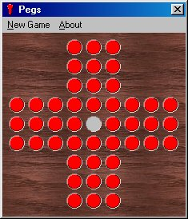



## Pegs

### Description

This is the classic game of pegs, for the people that dont know the game, you have to remove all pegs by moving one peg over another, the last peg you have left has to be in the center of the field. Please leave some comments to say what you think of it.
 
### More Info
 

             |
---                |---
**Submitted On**   |2002-02-15 09:40:44
**By**             |[Dennis Meelker](https://github.com/Planet-Source-Code/PSCIndex/blob/master/ByAuthor/dennis-meelker.md)
**Level**          |Beginner
**User Rating**    |5.0 (15 globes from 3 users)
**Compatibility**  |VB 5\.0, VB 6\.0
**Category**       |[Games](https://github.com/Planet-Source-Code/PSCIndex/blob/master/ByCategory/games__1-38.md)
**World**          |[Visual Basic](https://github.com/Planet-Source-Code/PSCIndex/blob/master/ByWorld/visual-basic.md)
**Archive File**   |[Pegs553732152002\.zip](https://github.com/Planet-Source-Code/dennis-meelker-pegs__1-31819/archive/master.zip)

